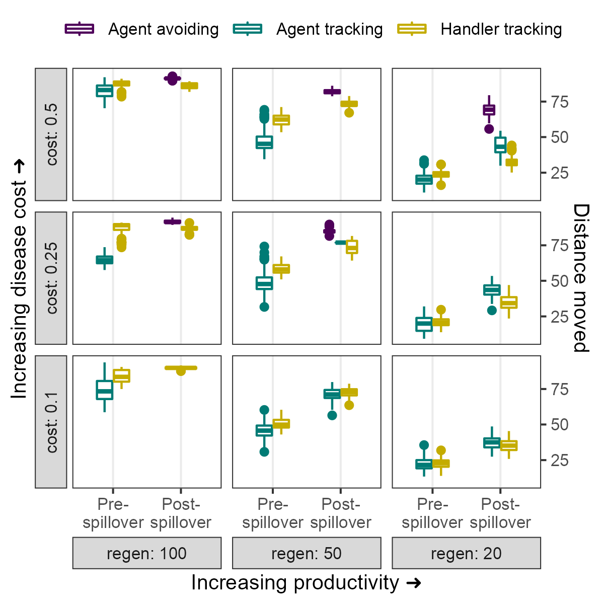
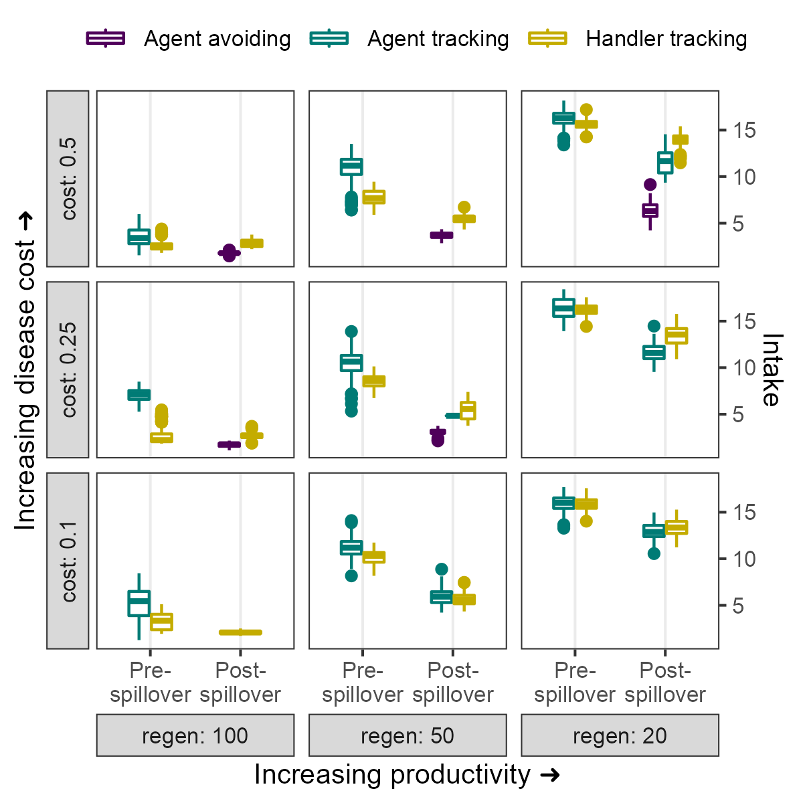

# Ecological changes in movement and associations across parameter combinations

```{r}
library(data.table)
library(ggplot2)
library(patchwork)
library(colorspace)
```


```{r}
# load data
data = fread("data/results/data_si_morphs.csv")
# data = data[scenario == "spillover" & regen == 50 & cost == 0.25]
data = data[social_strat != "non-handler tracking"]

# select pre and post spillover genes
data = data[between(gen, 3000, 3300) | between(gen, 4700, 5000)]
data[, type := fifelse(gen < 3500, "pre", "post")]

# select only if more than 10%
data = data[N > 75]

# order regen
data[, regen := factor(regen, levels = c("100", "50", "20"))]
```

```{r}
fig_movement = 
  ggplot(data)+
  geom_boxplot(
    aes(
      type, mean_move,
      # fill = social_strat,
      col = social_strat
    ),
    width = 0.5
  )+
  scale_colour_discrete_sequential(
    palette = "Viridis", 
    rev = F,
    l1 = 10, l2 = 70,
    name = NULL,
    labels = stringr::str_to_sentence
  )+
  scale_x_discrete(
    limits = c("pre", "post"),
    labels = c("Pre-\nspillover",
               "Post-\nspillover"),
    name = "Increasing productivity \u279c"
  )+
  scale_y_continuous(
    # labels = scales::percent,
    breaks = NULL,
    name = glue::glue("Increasing disease cost \u279c"),
    sec.axis = dup_axis(
      breaks = waiver(),
      # labels = scales::percent,
      name = "Distance moved"
    )
  )+
  theme_bw(
    base_size = 10,
    base_family = "Arial"
  )+
  facet_grid(
    rows = vars(cost),
    cols = vars(regen),
    as.table = F, 
    switch = c("both"),
    labeller = labeller(
      cost = function(x) sprintf("δE = %s", x),
      regen = function(x) sprintf("T<sub>R</sub> = %s", x)
    )
  )+
  theme(
    legend.position = "top", 
    legend.key.height = unit(1, "mm"),
    strip.placement = "outside",
    strip.text = ggtext::element_markdown(),
    axis.text.x = element_text(hjust = 0.5, size = 8)
  )

ggsave(
  fig_movement,
  filename = "supplement/figures/fig_movement.png",
  height = 4, width = 4
)
```



```{r}
fig_intake =
  ggplot(data)+
  geom_boxplot(
    aes(
      type, mean_intake,
      # fill = social_strat,
      col = social_strat
    ),
    width = 0.5
  )+
  scale_colour_discrete_sequential(
    palette = "Viridis", 
    rev = F,
    l1 = 10, l2 = 70,
    name = NULL,
    labels = stringr::str_to_sentence
  )+
  scale_x_discrete(
    limits = c("pre", "post"),
    labels = c("Pre-\nspillover",
               "Post-\nspillover"),
    name = "Increasing productivity \u279c"
  )+
  scale_y_continuous(
    # labels = scales::percent,
    breaks = NULL,
    name = glue::glue("Increasing disease cost \u279c"),
    sec.axis = dup_axis(
      breaks = waiver(),
      # labels = scales::percent,
      name = "Intake"
    )
  )+
  theme_bw(
    base_size = 10,
    base_family = "Arial"
  )+
  facet_grid(
    rows = vars(cost),
    cols = vars(regen),
    as.table = F, 
    switch = c("both"),
    labeller = labeller(
      cost = function(x) sprintf("δE = %s", x),
      regen = function(x) sprintf("T<sub>R</sub> = %s", x)
    )
  )+
  theme(
    legend.position = "top", 
    legend.key.height = unit(1, "mm"),
    strip.placement = "outside",
    strip.text = ggtext::element_markdown(),
    axis.text.x = element_text(hjust = 0.5, size = 8)
  )

ggsave(
  fig_intake,
  filename = "supplement/figures/fig_intake.png",
  height = 4, width = 4
)
```



```{r}
fig_assoc =
  ggplot(data)+
  geom_boxplot(
    aes(
      type, mean_assoc,
      # fill = social_strat,
      col = social_strat
    ),
    width = 0.5
  )+
  scale_colour_discrete_sequential(
    palette = "Viridis", 
    rev = F,
    l1 = 10, l2 = 70,
    name = NULL,
    labels = stringr::str_to_sentence
  )+
  scale_x_discrete(
    limits = c("pre", "post"),
    labels = c("Pre-\nspillover",
               "Post-\nspillover"),
    name = "Increasing productivity \u279c"
  )+
  scale_y_continuous(
    # labels = scales::percent,
    trans = ggallin::pseudolog10_trans,
    breaks = NULL,
    name = glue::glue("Increasing disease cost \u279c"),
    sec.axis = dup_axis(
      breaks = c(1, 100, 1000, 10000),
      labels = scales::comma_format(accuracy = 1),
      name = "Encounters"
    )
  )+
  theme_bw(
    base_size = 10,
    base_family = "Arial"
  )+
  facet_grid(
    rows = vars(cost),
    cols = vars(regen),
    as.table = F, 
    switch = c("both"),
    labeller = labeller(
      cost = function(x) sprintf("δE = %s", x),
      regen = function(x) sprintf("T<sub>R</sub> = %s", x)
    )
  )+
  theme(
    legend.position = "top", 
    legend.key.height = unit(1, "mm"),
    strip.placement = "outside",
    strip.text = ggtext::element_markdown(),
    axis.text.x = element_text(hjust = 0.5, size = 8)
  )

ggsave(
  fig_assoc,
  filename = "supplement/figures/fig_assoc.png",
  height = 4, width = 4
)
```