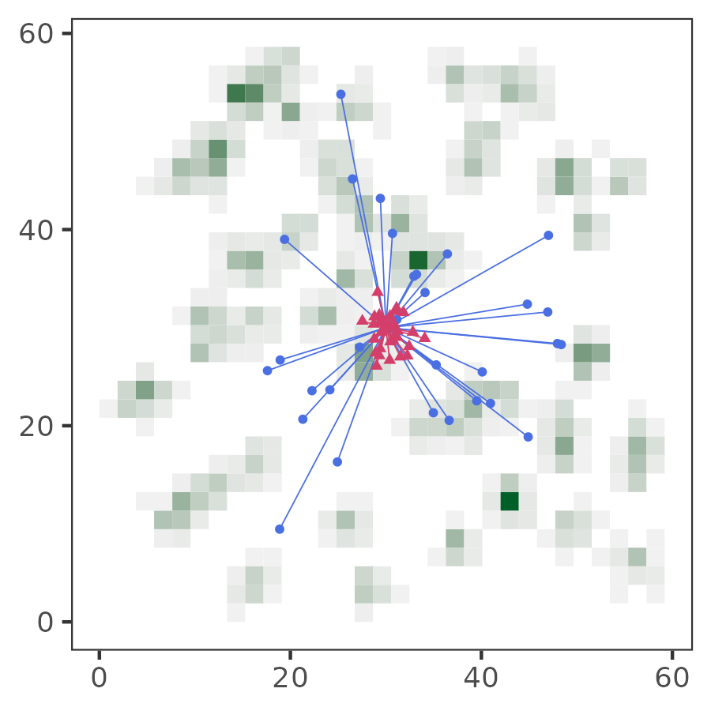

# The effect of modelling choices

Modelling choices can have a substantial effect on the outcomes of simulations with multiple, complex interactions among components [@netz2021a].
We show the effect of varying implementation on two key aspects of our model: (1) where individuals are initialised, or 'born', on the landscape (natal dispersal), (2) how the infectious pathogen imposes fitness costs.

## Global natal dispersal of individuals

Some models initialise the individuals in each new generation at random locations on the landscape [see e.g. @gupte2021].
This is a reasonable choice when modelling animals during a specific stage of their life cycle, such as after arrival after migration.
Contrasting this choice with our default implementation of local dispersal can help to investigate whether animals' movement strategies are the result of adaptation to beneficial local circumstances inherited from one's parents ('ecological inheritance'; @badyaev).
By forcing animals in each new generation to encounter ecological circumstances potentially different from those of their parents, implementing global dispersal can also help investigate whether animals' evolved movement strategies are truly optimal at the global scale [@gupte2021].

```{r}
library(ggplot2)
library(colorspace)
```

```{r}
l = pathomove::get_test_landscape(
  nItems = 1800,
  landsize = 60,
  nClusters = 60,
  clusterSpread = 1,
  regen_time = 50
)

global = data.frame(
  x = 30 + rnorm(30, 0, 10),
  y = 30 + rnorm(30, 0, 10),
  type = "global"
)

local = data.frame(
  x = 30 + rnorm(30, 0, 2),
  y = 30 + rnorm(30, 0, 2),
  type = "local"
)

agents = rbind(global, local)
```

```{r}
p = ggplot(l)+
  geom_bin2d(
    aes(
      x, y,
      fill = ..count..
    ),
    show.legend = F
  )+
  geom_segment(
    data = agents,
    aes(
      x = 30, y = 30,
      xend = x, yend = y,
      col = type
    ),
    size = 0.2,
    show.legend = F
  )+
  geom_point(
    data = agents,
    aes(
      x, y,
      col = type,
      shape = type
    ),
    size = 1,
    show.legend = F
  )+
  scale_colour_discrete_diverging(
    palette = "Blue-Red 2"
  )+
  scale_fill_continuous_sequential(
    palette = "Greens 2"
  )+
  theme_test()+
  theme(
    axis.title.x = element_blank(),
    axis.title.y = element_blank()
  )

ggsave(
  p,
  filename = "figures/fig_global_dispersal.png",
  height = 3,
  width = 3
)
```



### Evolutionary outcomes of the global dispersal implementation

Maybe some discussion text here.

![**Rapid evolutionary change leads to similar evolutionary outcomes in an alternative implementation of global dispersal.** In our alternative, global natal dispersal implementation, the handler tracking strategy is the dominant strategy across most parameter combinations. Following pathogen introduction, there is a rapid shift in the mix of movement strategies, and, as in the default local dispersal implementation, the agen avoiding strategy becomes common. When infection costs are low ($\delta E$ = 0.1) and landscape productivity is high ($R \geq$ 2), pathogen introduction does not alter the mix of movement strategies.](figures/fig_evo_change_global_dispersal.png){ width=70% }

### Ecological consequences in the percentage cost implementation

Maybe some text here.

{ width=70% }
