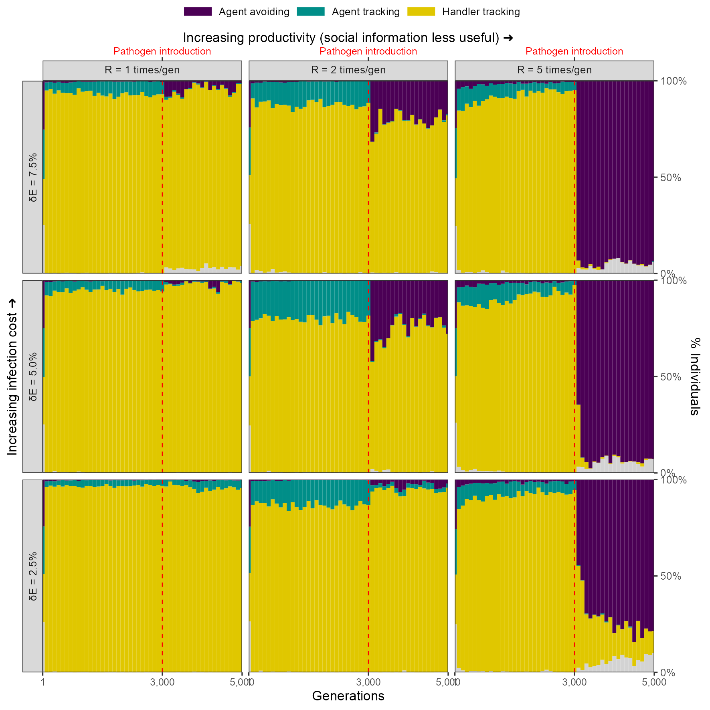

# The effect of modelling choices

Modelling choices can have a substantial effect on the outcomes of simulations with multiple, complex interactions among components [@netz2021a].
We show the effect of varying implementation on two key aspects of our model: (1) how the infectious pathogen imposes fitness costs, and (2) where individuals are initialised, or 'born', on the landscape (natal dispersal).

## Infection cost as a percentage of intake

### Default implementation: Infection costs and intake are independent

In our model's default implementation, the infectious pathogen imposes a direct cost, $\delta E$, on individuals, in each timestep that they are infected.
For an individual with intake $N$, the net energetic gain $E$ after being infected by a pathogen for $t$ timesteps is $E = N - (\delta E \times t)$.

In this scenario, _infection costs are independent of intake_.

This implementation is used in ...

### Alternative implementation: Infection costs as a percentage of intake

In an alternative implementation, the infectious pathogen may be considered to reduce an animal's ability to process intake, or to require a portion of daily intake to resist.
Such an implementation is used in ...

For an individual with intake $N$, the net energetic gain $E$ after being infected by a pathogen for $t$ timesteps is $E = N \times (1 - \delta E) ^ t$.

### Comparing cost structures across implementations

Naturally, the two cost structures are not easy to compare.

```{r, echo=FALSE}
library(data.table)
library(ggplot2)
library(patchwork)
library(colorspace)

# simulate direct costs
cost_direct = CJ(
  intake = seq(0, 20, 1),
  ti = seq(0, 100, 5),
  delta_e = 0.25,
  type = "direct"
)
cost_direct[, energy := (intake - (ti * delta_e))]

# simulate percentage costs
cost_percent = CJ(
  intake = seq(0, 20, 1),
  ti = seq(0, 100, 5),
  delta_e = 0.05,
  type = "percent"
)
cost_percent[, energy := (intake * (1 - delta_e)^ti)]

# combine data
cost_sims = rbindlist(
  list(cost_direct, cost_percent)
)

p_costs =
  ggplot(cost_sims)+
  geom_tile(
    aes(
      intake, ti,
      fill = energy
    )
  )+
  scale_fill_continuous_diverging(
    rev = T,
    palette = "Blue-Yellow",
    name = "Net\nenergy",
    c1 = 120
  )+
  facet_wrap(
    ~type,
    labeller = labeller(
      type = c(
        "direct" = "Direct cost",
        "percent" = "Percentage cost"
      )
    )
  )+
  theme_test()+
  theme(
    legend.key.width = unit(2, "mm")
  )+
  coord_cartesian(
    expand = F
  )+
  labs(
    x = "Intake",
    y = "Time infected"
  )

ggsave(
  p_costs,
  filename = "figures/fig_cost_structure.png",
  height = 3, width = 6
)
```

### Evolutionary outcomes of the percentage cost implementation

