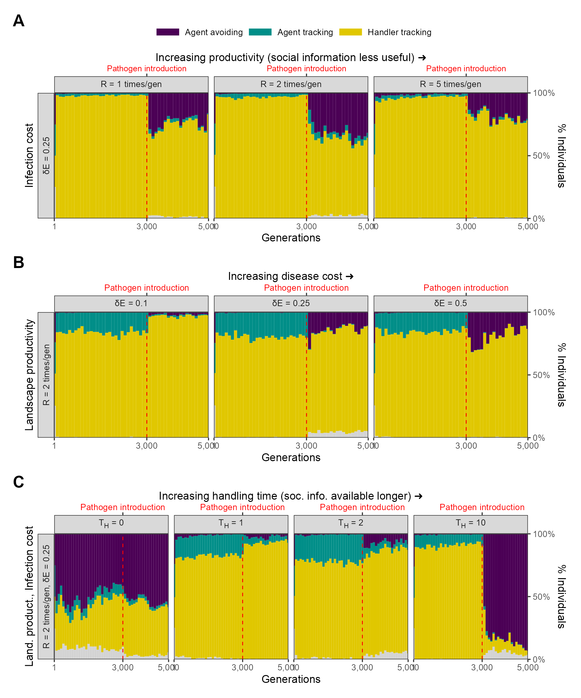

```{r echo=FALSE}
library(data.table)
library(ggplot2)
library(patchwork)
library(colorspace)
```

# Comparing ecological outcomes across parameter combinations

![**Changes in population-level outcomes following pathogen introduction.** The introduction of the infectious pathogen leads to rapid evolutionary changes in movement strategies (see Figures 2 and 5; main text) across most combinations of landscape productivity and infection cost. In all combinations where there is rapid evolutionary shift in social-movement strategies, there is a similar change in the population's behavioural outcomes, with more movement and fewer associations. However, there is no change in per-capita intake. Each subplot in each panel shows the mean and standard error of the per-capita values for **(A)** distance moved, **(B)** intake, **(C)** number of associations, or encounters, with other individuals. Means and standard deviations are shown before (G = 3,000) and after (G = 3,500) pathogen introduction; each data point represents 10 replicates of the relevant parameter combination. In most cases, standard error is too small to be visible.](figures/fig_eco_compare_default.png)

# Effect of modelling choices on simulation outcomes

Modelling choices can have a substantial effect on the outcomes of simulations with multiple, complex interactions among components [@scherer2020;@netz2021;@gupte2021].
We show the effect of varying implementation on some key aspects of our model, with a focus on our scenario 1 (with repeated pathogen introduction): (1) how the infectious pathogen imposes fitness costs, (2) where individuals are initialised, or 'born', on the landscape relative to their parents' positions (which may be thought of as natal dispersal), (3) whether individuals are allowed to reproduce when they have a negative energy balance, (4) the duration for which social information is available, in the form of changes to the handling time, (5) changes to the spatial structure of the landscape, and (6) the sporadic introduction of the pathogen.

## Infection cost as a reduction in foraging efficiency

In our model's default implementation, the infectious pathogen imposes a direct cost, $\delta E$, on individuals, in each timestep that they are infected.
For an individual with intake $N$, the net energetic gain $E$ after being infected by a pathogen for $t$ timesteps is $E = N - (\delta E \times t)$.
In this scenario, _infection costs are independent of intake_.
In an alternative implementation, the infectious pathogen may be considered to reduce an animal's ability to process intake, or to require a portion of daily intake to resist.
For an individual with intake $N$, the net energetic gain $E$ after being infected by a pathogen for $t$ timesteps is $E = N \times (1 - \delta E) ^ t$.
Naturally, the two cost structures are not easy to compare directly, but Fig. S2 shows the outcomes for energy in a representative case.

```{r, echo=FALSE}
# simulate direct costs
cost_direct <- CJ(
  intake = seq(0, 20, 1),
  ti = seq(0, 100, 5),
  delta_e = 0.25,
  type = "direct"
)
cost_direct[, energy := (intake - (ti * delta_e))]

# simulate percentage costs
cost_percent <- CJ(
  intake = seq(0, 20, 1),
  ti = seq(0, 100, 5),
  delta_e = 0.05,
  type = "percent"
)
cost_percent[, energy := (intake * (1 - delta_e)^ti)]

# combine data
cost_sims <- rbindlist(
  list(cost_direct, cost_percent)
)

p_costs <-
  ggplot(cost_sims) +
  geom_tile(
    aes(
      intake, ti,
      fill = energy
    )
  ) +
  scale_fill_continuous_diverging(
    rev = T,
    palette = "Blue-Yellow",
    name = "Net\nenergy",
    c1 = 120
  ) +
  facet_wrap(
    ~type,
    labeller = labeller(
      type = c(
        "direct" = "Direct cost",
        "percent" = "Percentage cost"
      )
    )
  ) +
  theme_test() +
  theme(
    legend.key.width = unit(2, "mm")
  ) +
  coord_cartesian(
    expand = F
  ) +
  labs(
    x = "Intake",
    y = "Time infected"
  )

ggsave(
  p_costs,
  filename = "supplement/figures/fig_cost_structure.png",
  height = 3, width = 6
)
```

![Calculated net energy for different combinations of intake and time infected. In the _Direct cost_ scenario, and with a $\delta E$ of 0.25 (shown here), which is our default implementation, an individual foraging on an item (handling time = 5 timesteps) would gain 1.0 unit of intake, and lose 1.25 units of energy in that same period if it were infected, for a net energy balance in that period of -0.25. Individuals' energetic balance is normalised (0 -- 1) with reference to the lowest value in each generation. Here, individuals' infection cost is _independent_ of their intake. In the _Percentage cost_ scenario, individuals' infection costs are linked to their intake. For a per-timestep 5% loss of intake (shown here), individuals infected for >25 timesteps already have a net energy balance close to, but never less than, zero. In this implementation, individuals' energy balances are _not normalised_ with reference to the lowest net energy, as no individual's energy is ever less than zero.](figures/fig_cost_structure.png){ width=70% }

### Evolutionary outcomes of the percentage cost implementation

The social movement strategies evolved prior to pathogen introduction are identical to those seen in our default implementation (Fig. S3).
This is because the percentage cost implementation differs from the default only after the pathogen is introduced.
After pathogen introduction, there is a rapid evolutionary shift in movement strategies similar to that in our default implementation, but only when the costs of infection are relatively high ($\delta E$ = 7.5%), and the usefulness of social information is limited by the abundance of food items ($R$ = 5).
Under these conditions, the agent avoiding strategy becomes the commonest strategy.
Under conditions of median landscape productivity and intermediate to high pathogen costs ($\delta E \in$ 5.0% and 7.5%, $R$ = 2), the agent avoiding strategy also emerges, but forms only a low proportion of the population.
Under all other conditions, the handler tracking strategy continues as the commonest strategy (Fig. S3).

![**Rapid evolutionary change under some conditions in an alternative implementation of disease costs.** In our alternative, percentage costs implementation of the infectious pathogen, there is a rapid shift in the mix of movement strategies after pathogen introduction, but only when the costs of infection are relatively high (7.5%), and the usefulness of social information is limited by the abundance of food items (R = 5). In these cases, the agent avoiding strategy is the commonest social movement strategy, forming a smaller proportion of the population mixture of social movement strategies when the infection cost is lower, or when the usefulness of social information is greater (lower $\delta E$ and lower $R$ respectively).](figures/fig_evo_change_percent_cost.png){ width=70% }

## Large-scale natal dispersal of individuals

Some models initialise the individuals in each new generation at random locations on the landscape [see e.g. @gupte2021]; this can be called large-scale or 'global' natal dispersal.
This is a reasonable choice when modelling animals during a specific stage of their life cycle, such as after arriving on a wintering or breeding site after migration.
Our default choice, on the other hand, is small-scale or 'local' natal dispersal, where individuals are initialised close to their parent's last position.
This is also defensible, as many organisms do not disperse very far from their ancestors.
When animals do not disperse very far, they may not evolve movement rules that can be generalised across all landscape conditions, especially when the landscape is ecologically heterogeneous.
Instead, animals may adapt their strategies to the local conditions which they inherit from their parents ['ecological inheritance': @badyaev2009].

Successful individuals are likely to have more offspring than unsuccessful individuals, and successful individuals are likely to be found --- in our simulation and in real natural systems --- on or near profitable resource patches.
This means that many individuals are initialised near profitable patches.
In this case, and because of the sparse distribution of resource patches on the landscape, individuals adapt to tolerate their many neighbours (who are often kin), as avoiding them would lead to also moving away from a profitable patch.

By forcing animals in each new generation to encounter ecological circumstances potentially different from those of their parents, implementing global dispersal can help investigate whether animals' evolved movement strategies are truly 'optimal' at the global scale [@gupte2021].
We implementated global dispersal by running 10 replicates of each parameter combination (3 combinations of $\delta E$ = 0.25 and $R \in$ 1, 2, 5; 30 simulations in all), with dispersal set to 10.
This means that individuals' initial positions are drawn from a normal distribution with standard deviation = 10, centred on the location of their parent (Fig. S4).

```{r echo=FALSE}
l <- pathomove::get_test_landscape(
  nItems = 1800,
  landsize = 60,
  nClusters = 60,
  clusterSpread = 1,
  regen_time = 50
)

global <- data.frame(
  x = 30 + rnorm(30, 0, 10),
  y = 30 + rnorm(30, 0, 10),
  type = "global"
)

local <- data.frame(
  x = 30 + rnorm(30, 0, 2),
  y = 30 + rnorm(30, 0, 2),
  type = "local"
)

agents <- rbind(global, local)
```

```{r echo=FALSE}
p <- ggplot(l) +
  geom_bin2d(
    aes(
      x, y,
      fill = ..count..
    ),
    show.legend = F
  ) +
  geom_segment(
    data = agents,
    aes(
      x = 30, y = 30,
      xend = x, yend = y,
      col = type
    ),
    size = 0.2,
    show.legend = F
  ) +
  geom_point(
    data = agents,
    aes(
      x, y,
      col = type,
      shape = type
    ),
    size = 1,
    show.legend = F
  ) +
  scale_colour_discrete_diverging(
    palette = "Blue-Red 2"
  ) +
  scale_fill_continuous_sequential(
    palette = "Greens 2"
  ) +
  theme_test() +
  theme(
    axis.title.x = element_blank(),
    axis.title.y = element_blank()
  )

ggsave(
  p,
  filename = "supplement/figures/fig_global_dispersal.png",
  height = 3,
  width = 3
)
```

![**Differences between small-scale and large-scale natal dispersal.** Initialising individuals in each new generation within a standard deviation of 10 units around their parent (**blue**; parent at [30, 30]) places can lead them to encounter potentially very different ecological, and social, circumstances from those of their parent. In contrast, individuals initialised close to their parents (within a standard deviation of 2 units; **red**) encounter very similar conditions as their parent. The latter also leads to substantial competition among kin. We used 10 units to represent (nearly) global dispersal, and 2 units to represent local dispersal; this is controlled by the simulation parameter _dispersal_, which takes a numeric argument.](figures/fig_global_dispersal.png)

We found that our model is broadly robust to implementing large-scale natal dispersal, with the evolutionary outcomes very similar to those seen in our default implementation with small-scale natal dispersal (Fig. S5A, compare main text Figs. 2, 6).
Since individuals are initialised relatively far away from their parent's position, they encounter potentially very different ecological conditions, both in terms of the number of other individuals, and the local availability of food items.
As a result, most individuals evolve a 'handler tracking' social movement strategy before the introduction of the novel pathogen.
This strategy allows individuals to gain the benefits of social information on the location of a resource patch (of which handlers are an indirect cue), while avoiding potential competitors, as well as potentially moving away from areas without many food items.
After pathogen introduction, there is a rapid evolutionary shift in social movement strategies, with an increase in 'agent avoidance', similar to the shift seen in our default implementation of local dispersal.
The effect of landscape productivity on the mix of proportions of the pre- and post-pathogen introduction strategies does not appear to be significant.

## Energy threshold on reproduction

Individuals may skip reproduction when their body condition is below some threshold, as would be expcted when infected by a transmissible pathogen.
We explored how restricting reproduction to only those individuals which had a positive energy balance ($\sum \text{intake} > \delta E\sum \text{time~infected}$) would affect our simulation outcomes.
We found that for our default parameter combination the handler tracking strategy persists as the commonest strategy after pathogen introduction, with agent avoidance making up a small proportion of the population \textbf{(SI Appendix Fig. S5B)}.
At a lower infection cost ($\delta E$ = 0.1), there is broadly no effect of pathogen introduction on the evolved social movement strategy, and handler tracking persists at a high frequency.
When infection costs are higher ($\delta E$ = 0.5), handler tracking still persists after pathogen introduction, but with frequent and strong irruptions of agent avoiding individuals over the generations following introduction.

## Persistence of social information in the form of changes to handling time

In our model, the availability of inadvertent social information on the location of food item clusters is controlled by the handling time parameter $T_H$ (default = 5 timesteps).
We explored the effect of the availabiltiy of social information on which social movement strategies were evolved after pathogen introduction by running our default implementation of scenario 1 ($\delta E$ = 0.25, $R$ = 2) with four alternative values of handling time: 0, 1, 2, and 10.
We found that at low handling times ($T_H \in$ 1, 2), the handler tracking strategy persists as the dominant strategy after pathogen introduction, with a small proportion of agent avoiding individuals **(SI Appendix Fig. S5C)**.
When handling time is doubled from the default ($T_H$ = 10), the agent avoiding strategy rapidly becomes the dominant strategy.
As handling time increases, more individuals are immobilised as handlers, increasing the availability of inadvertent social information that is helpful in locating resources.
However, after pathogen introduction, the cumulative risk of pathogen transmission is also increased with increased handling time when two handlers are within transmission distance, and one of them is infected.
These results then suggest that the evolution of how social information is used can be strongly influenced by its indirect costs (here, transmission risk).
When individuals do not need to handle food before consuming it ($T_H$ = 0), a mixture of handler tracking and agent avoiding strategies persists in the population from the beginning of the simulation, with no change following pathogen introduction **(SI Appendix Fig. S5C)**.
In this case, there are never any handlers, and thus oscillations in social movement strategy most likely represent neutral variation around the handler preference $s_H$; most individuals would more accurately be described as `non-handler avoiding'.



## Spatial structure of the resource landscape

Since ours is a spatial model, and the explicit consideration of space and movement is key to its outcomes, we very briefly examined the effect of landscape spatial structure on the evolutionary outcomes of our scenario 1 (Fig. S6A).
We expected spatial structure to have a substantial effect as suggested in previous studies [@he2021].
To do this, we ran ten replicates of our default scenario with two alternative food item distributions: in the first, we distributed food items uniformly across the landscape, while in the second, we modelled a landscape that was patchier than our default, with only 10 food item clusters (default number of clusters = 60).
We compared the outcomes on these landscapes with those from our default scenario, with all parameters expect spatial structure kept the same ($R$ = 2, $\delta E$ = 0.25, $N$ food items = 1,800; Fig. S6B).

Landscape spatial structure influences the mixture of social movement strategies evolved before pathogen introductions (Fig. S6A).
On the uniform landscape, handler tracking was the commonest strategy before pathogen introduction, with nearly all individuals of this strategy.
In contrast, on the more patchy landscape, the indiscriminately social agent tracking strategy was the most common before pathogen introductions.
Both of these are in contrast with our default scenario, in which most individuals were handler tracking, but with a substantial proportion of agent tracking individuals.

This overall pattern is likely due to the increasing benefit of social information and the increasing costs of movement between profitable areas of the landscape.
Specifically, as landscapes become more clustered, direct food item cues become more difficult to find, as food items are found in smaller and denser patches.
This increases the value of sociality, as individuals are likely to found near food item clusters.
Furthermore, the indirect costs of movement also increase on patchy resource landscapes, as individuals have to pay an increased cost in time (which could have been spent foraging) in moving between food item clusters.
In an implementation not formally shown here, the same effect can be achieved by adding a small cost to each movement step --- this leads to the evolution of indiscriminate sociality in the form of agent tracking on the default landscape as well.
Overall, both the increasing local density of food items and the costs of movement lead to an increase in agent tracking, as individuals prefer to trade movement costs for the costs of increased local competition for food items.

Following pathogen introduction, populations on both landscapes undergo a rapid evolutionary transition to a mixture of handler tracking and agent avoiding strategies, which is similar to the change observed in our default scenario (Fig. S6A).
However, the landscapes differ in the proportions of the two strategies, with agent avoidance more common on the uniform landscape than on the patchy landscape.
Interestingly, both of these extremes of landscape structure have more agent avoiding individuals than our default landscape of 60 food item clusters.
On the uniform landscape, this is likely because food items are readily found with the need for indirect social cues, and so most individuals avoid each other.
It is less clear why this is the case on the more patchy landscape --- it is possible that the denser food item patches lead to more associations and more rapid pathogen spread, with handler tracking individuals infected for longer periods than agent avoiding ones, leading to an intake-infection trade-off.

Overall, this scenario demonstrates how spatial structure can play an important role in the evolution of social movement strategies, but also how the risk of infection can lead to landscapes with very different spatial structures eventually populated by similar social movement strategies.

![**Landscape spatial structure influences the evolution of social movement strategies before, but not after, pathogen introduction.** **(A)** In two implementations with different spatial structures ($R$ = 2, $\delta E$ = 0.25), pre-pathogen dynamics are actually more different than post-introduction ones. On landscapes with a uniform food distribution (left panel: _Uniform distribution_), all individuals before pathogen introduction were handler tracking. Yet on more clustered landscapes (right panel: _10 food patches_; default = 60, center panel), the rare agent tracking strategy is most common before pathogen introduction. This is likely because the time cost of moving between distant patches on clustered landscapes is higher than that of exploitation competition. After pathogen introduction, agent avoidance rapdily becomes a common strategy. It is more dominant on uniform landscapes (approx. 80\%) likely because the usefulness of social information is lower there.](figures/fig_eco_evo_spatial.png)

## Sporadic introduction of infectious pathogens

Finally, we implemented a variant of our main model, in which the infectious pathogen is introduced only sporadically after the first introduction event (at G = 3,000; Fig. S7).
Specifically, we modelled probabilistic introduction of the pathogen in each generation following the initial introduction.
We call the per-generation probability of a novel pathogen introduction event the 'spillover rate'.
We ran 10 replicates each of this model variant and examined whether there was a similar evolutionary shift in social movement strategies as seen in our default implementation.
Since it is the main parameter of interest, we ran this model variant for three values of the spillover rate: 0.05, 0.1, and 0.25.
Instead of examining the joint effect of landscape productivity and cost of infection as well, we only examined the effect of infection cost, implementing three different variants with an infection cost $\delta E$ of 0.1, 0.25, and 0.5.
We kept all other model parameters similar to the default scenario of our main model, and importantly, considered only a landscape productivity $R$ of 2.
Cross-species novel pathogen introductions are likely to become more common with climate change, and so we chose these spillover rate values to represent different scenarios under altered global regimes of pathogen transfer.
Our model's default implementation may be seen as an extreme case of the models considered here, with a spillover rate of 1.0.

In our model code, the sporadic introduction is implemented by drawing the number of generations until the next pathogen introduction event from a geometric distribution whose probability parameter is given by the spillover rates described above.
Zero values are handled by converting them into ones.
At our lowest spillover rate, up to 100 generations could pass between pathogen introductions, while at our highest rates, there are rarely more than 10 generations between introductions (Fig. S7A).

The social movement strategies evolved prior to pathogen introduction are identical to those seen in our default implementation (Fig. S7B).
However, following pathogen introduction, we found that there was little to change in the population-level mixture of movement strategies in this model variant (see figure).
This is regardless of the probability of a novel pathogen introduction (our so-called 'spillover rate'), and the cost of infection by a pathogen.
Across the simulation, the commonest social movement strategy remains handler tracking, i.e., preferring locations with multiple individuals regardless of their foraging status.
Since there is little to no change in social movement strategies, we did not expect nor find changes in ecological outcomes.

![**No evolutionary change in social movement strategies when novel pathogen introduction events are relatively uncommon.** **(A)** In our alternative implementation of the model, the pathogen is only introduced sporadically after the initial introduction (G = 3,000; red line in panel B). **(B)** When the introductions are relatively rare and sporadic, there is no shift in the mixture of movement strategies after pathogen introduction. The handler tracking strategy remains common across parameter combinations. ](figures/fig_evo_strategy_sporadic.png){ width=70% }

# References
